# 基于springboot的大创管理系统

---
### 👉作者QQ ：1556708905 微信：zheng0123Long (支持定制修改、部署调试、定制毕设)

### 👉接网站建设、小程序、H5、APP、各种系统等

---

#### 介绍

随着高校对创新创业教育的重视程度不断提高，大学生创新创业项目的数量和规模迅速增长。为了更高效、规范地管理这些项目，本基于 SpringBoot 的大创管理系统应运而生。它旨在解决传统管理方式中存在的诸多问题，如信息分散、流程复杂、沟通不畅等，为大创项目的顺利开展提供有力的支持。

#### 技术栈

后端技术栈：Springboot+Mysql+Maven

前端技术栈：Vue+Html+Css+Javascript+ElementUI

开发工具：Idea+Vscode+Navicate

#### 系统功能介绍

（一）管理员角色  
个人中心：  
管理员可以查看和修改自己的个人信息，包括联系方式、登录密码等。  
接收系统发送的重要通知、任务提醒以及消息提示。  
学生管理：  
查看学生的详细个人信息，如姓名、学号、所在院系、专业等。  
审核学生的注册申请，对学生账号进行激活或禁用操作。  
管理学生参与大创项目的历史记录和成果。  
指导老师管理：  
登记指导老师的个人资料，包括姓名、职称、研究领域等。  
审核指导老师的资质和指导能力。  
为指导老师分配或调整所指导的学生项目。  
院系管理员管理：  
增加、删除或修改院系管理员的账号信息。  
设定院系管理员的权限范围，如仅管理本院系项目或具有跨院系管理权限。  
监督院系管理员的工作绩效和操作记录。  
优秀项目管理：  
制定优秀项目的评选标准和流程。  
对申报的项目进行评估和筛选，确定优秀项目名单。  
展示优秀项目的详细信息和成果，供其他学生和老师学习借鉴。  
项目类型管理：  
定义和分类大创项目的类型，如科技创新、社会调研、文化创意等。  
为每种项目类型设置特定的要求和评价指标。  
项目信息管理：  
录入和维护大创项目的基本信息，如项目名称、负责人、所属院系、项目简介等。  
跟踪项目的进展状态，包括已申报、已立项、中期检查、结项等。  
查看项目的详细文档和报告，如项目计划书、中期检查报告、结项报告等。  
项目申报管理：  
发布项目申报的通知和要求，包括申报时间、申报材料、申报流程等。  
接收学生提交的项目申报材料，进行初步审核和分类。  
将审核通过的项目申报材料提交给相关评审人员进行评审。  
项目中检管理：  
制定项目中期检查的时间安排和检查内容。  
收集和审核项目中期检查的报告和成果。  
对中期检查不通过的项目提出整改要求和建议。  
项目结项管理：  
明确项目结项的条件和标准。  
受理项目结项申请，组织结项评审工作。  
对结项通过的项目进行归档和总结，对未通过的项目要求延期或终止。  
项目评审管理：  
组建项目评审团队，包括校内专家、校外专家等。  
制定评审规则和评分标准，确保评审的公平、公正、公开。  
协调评审人员的时间安排，组织评审会议或在线评审活动。  
专家评审管理：  
维护专家评审人员的信息库，包括专家的姓名、单位、专业领域、联系方式等。  
评估专家评审的工作质量和效率，对表现优秀的专家进行表彰和奖励，对不符合要求的专家进行调整。  
根据项目需求邀请合适的专家参与评审工作。  
评审方案管理：  
设计不同类型项目的评审方案，包括评审环节、评审重点、权重分配等。  
根据实际情况对评审方案进行调整和优化。  
确保评审方案符合学校的创新创业教育政策和目标。  
系统管理：  
进行系统的参数设置，如服务器配置、数据存储策略、安全设置等。  
分配不同角色的系统操作权限，确保数据的安全性和保密性。  
对系统进行日常维护和监控，及时处理系统故障和异常情况。   
定期对系统进行数据备份和恢复演练，保障数据的完整性和可用性。  
（二）学生角色  
竞赛信息：  
查看各类大创竞赛的详细介绍，包括竞赛主题、参赛要求、奖项设置等。  
了解竞赛的报名时间、比赛流程和评审规则。  
接收竞赛相关的通知和提醒，及时掌握竞赛动态。  
优秀项目：  
浏览学校内的优秀大创项目案例，学习其创新思路和实践经验。  
查看优秀项目的详细报告和展示资料，获取项目实施的关键步骤和方法。  
与优秀项目的负责人进行交流和互动，请教问题和寻求合作机会。  
项目信息：  
搜索和查看不同类型的大创项目信息，了解项目的研究内容、预期成果和应用前景。  
对比不同项目的特点和难度，选择适合自己的项目方向。  
关注感兴趣项目的进展情况，跟踪项目的最新动态。  
评审方案：  
查阅自己参与项目的评审方案，明确评审的标准和要求。  
按照评审方案的指导，有针对性地准备项目材料和进行项目改进。  
了解评审的流程和时间安排，提前做好相应的准备工作。  
大创资讯：  
获取最新的大创政策法规、学校的支持措施和相关的创新创业新闻。  
阅读关于创新创业的培训课程、讲座活动和实践机会的信息。  
了解行业内的创新创业趋势和前沿技术，拓宽创新视野。  
个人中心：  
完善个人基本信息，如联系方式、专业特长等。  
查看自己参与的大创项目列表和项目详情。  
上传和更新自己在项目中的成果和报告。  
接收与自己相关的通知和消息，如项目审核结果、评审反馈等。  
后台管理：  
优秀项目管理：关注自己所在团队或感兴趣的优秀项目的发展动态。  
项目类型管理：了解不同类型项目的特点，为自己的项目选择合适的类型。  
项目信息管理：及时更新自己负责项目的信息，确保数据准确无误。  
项目申报管理：填写和提交项目申报材料，发起项目申报流程。  
项目中检管理：按照要求提交项目中期检查报告，汇报项目进展情况。  
项目结项管理：整理和提交项目结项材料，申请项目结项审核。  
项目评审管理：查看项目评审的结果和专家意见，根据反馈进行改进。  
专家评审管理：了解参与自己项目评审的专家信息和评审意见。  
（三）指导老师角色   
优秀项目：  
推荐优秀的大创项目给学生，作为学习和参考的范例。  
对优秀项目进行点评和分析，为学生提供更深入的指导和启示。  
跟踪优秀项目的后续发展和应用情况，总结成功经验。  
项目信息：  
全面掌握所指导学生的大创项目信息，包括项目进展、遇到的问题等。  
对比不同项目的特点和优势，为学生提供个性化的指导建议。  
与其他指导老师交流项目信息，共同探讨指导方法和策略。  
评审方案：  
熟悉项目评审的方案和标准，为学生提供针对性的指导，使其符合评审要求。  
对评审方案提出改进意见和建议，以提高评审的科学性和合理性。  
根据评审方案，评估所指导学生项目的优势和不足，提前做好应对准备。  
大创资讯：  
及时了解大创领域的最新政策动态、研究成果和实践经验。  
掌握学校关于大创项目的最新支持措施和工作安排。  
分享有价值的大创资讯给学生，激发学生的创新思维和创业热情。  
个人中心：  
维护个人的教学和指导工作经历、研究成果等信息。  
查看自己指导学生的名单和项目分配情况。  
接收学校和学生发送的相关通知和消息。  
后台管理：  
优秀项目管理：参与优秀项目的评选过程，提供专业的评价和建议。  
项目类型管理：协助学生根据项目内容和目标选择恰当的项目类型。  
项目信息管理：实时关注所指导项目的信息更新，确保项目按计划推进。  
项目申报管理：指导学生撰写规范、高质量的项目申报书，提高申报成功率。  
项目中检管理：认真审查学生提交的中期检查报告，提出具体的改进意见和措施。  
项目结项管理：严格审核学生项目的结项成果，确保达到预期目标。  
项目评审管理：以专业视角对学生项目进行评审，给出客观、公正的评价。  
专家评审管理：协助学校管理专家评审资源，推荐合适的专家参与项目评审。  
评审方案管理：结合教学和实践经验，为完善评审方案提供建设性意见。  
（四）院系管理员角色  
优秀项目：  
在本院系内宣传和推广优秀大创项目，激发学生的创新积极性。  
组织本院系学生对优秀项目进行学习和研讨，促进经验交流和传承。  
跟踪本院系优秀项目的后续转化和应用情况，为其他项目提供示范。  
项目信息：  
全面了解本院系大创项目的整体情况，包括项目数量、类型、进展等。  
分析本院系项目的特点和优势，为制定院系的创新创业发展规划提供依据。  
向院系领导汇报项目信息，为决策提供支持。  
评审方案：  
根据学校的评审方案，结合院系实际情况，制定本院系的具体评审实施细则。  
向本院系的师生解读评审方案，确保其理解和遵守评审要求。  
收集师生对评审方案的反馈意见，及时向学校反映并提出改进建议。  
大创资讯：  
及时将学校发布的大创资讯传达给本院系的师生，确保信息畅通。  
组织本院系师生开展大创资讯的学习和讨论活动，促进创新创业意识的提升。  
收集本院系师生对大创资讯的需求和关注点，为学校提供参考。  
个人中心：  
完善个人的工作信息和职责范围。  
查看自己负责的工作任务和完成情况。  
接收来自学校和院系的通知和工作安排。  
后台管理：  
优秀项目管理：挖掘和培育本院系有潜力的大创项目，争取更多优秀项目成果。  
项目类型管理：根据院系的学科特点和发展需求，优化项目类型的设置和管理。  
项目信息管理：准确录入和更新本院系大创项目的信息，保证数据的完整性和准确性。  
项目申报管理：审核本院系学生的项目申报材料，提出修改意见和建议。  
项目中检管理：按照要求组织本院系项目的中期检查工作，督促项目团队按时完成任务。  
项目结项管理：严格把关本院系项目的结项审核，确保项目质量符合标准。  
项目评审管理：协调本院系的项目评审工作，保证评审过程的公平、公正、公开。  
专家评审管理：推荐本院系的专业教师作为专家参与评审工作，提高评审的专业性和针对性。  
评审方案管理：根据院系的实际情况，对学校的评审方案提出合理的调整建议，使其更符合院系的需求。  

#### 系统作用

提升管理效率与精度  
自动化的流程和集中化的信息管理显著减少了人工操作和信息误差，使大创项目管理更加高效准确。  
实时的数据更新和统计分析功能，为决策提供了及时、全面、准确的依据。  
促进资源合理分配  
清晰了解师生的专长和项目需求，能够精准匹配指导老师和学生，优化专家资源配置。  
重点扶持优秀项目，确保资源向有潜力、有价值的项目倾斜。  
保障项目质量与规范性  
标准化的申报、中检和结项流程，以及严格的评审制度，有力保障了项目的质量和规范性。  
及时的反馈和指导机制有助于学生不断完善项目，提升项目的创新水平和实践价值。  
增强沟通与协作效果  
搭建了便捷的沟通平台，方便学生、老师、院系管理员和管理员之间的信息交流与协作。  
促进了跨院系、跨学科的合作，营造了开放、共享的创新创业环境。  
推动创新创业教育发展  
系统的规范化管理和资源支持，激发了学生的创新创业热情，培养了学生的创新思维和实践能力。  
积累的优秀项目成果和经验，为学校的创新创业教育提供了丰富的教学素材和案例。  

#### 系统功能截图

代码结构

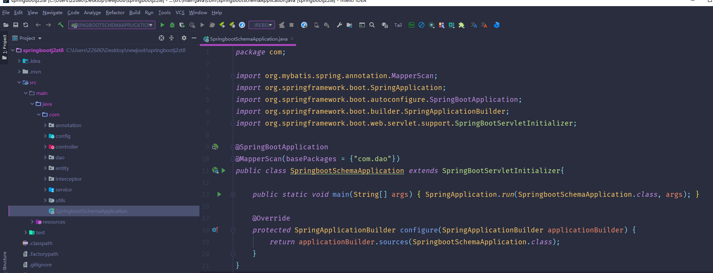

数据库表

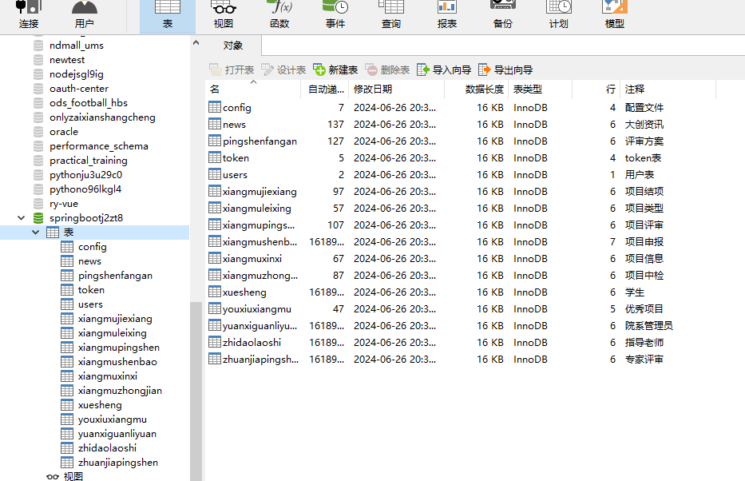

登录

优秀项目

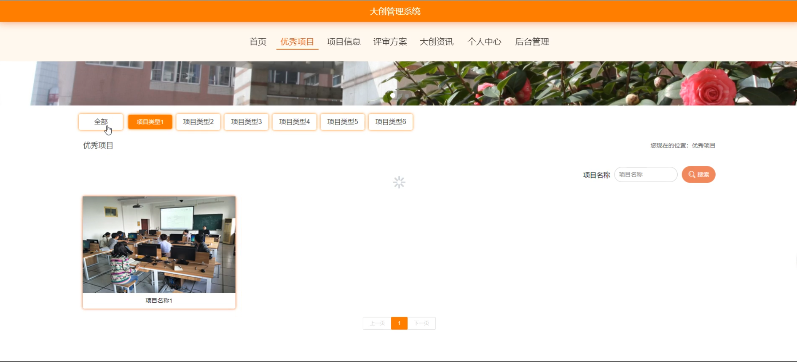

项目信息

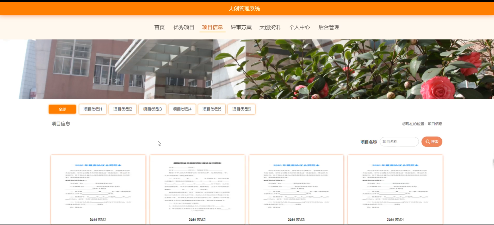

大创资讯

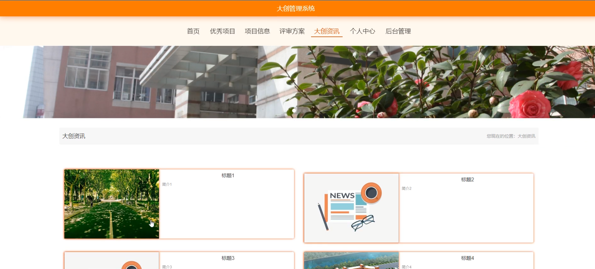

个人中心

学生端后台管理

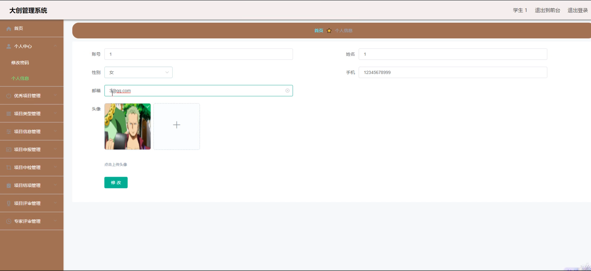

项目评审管理

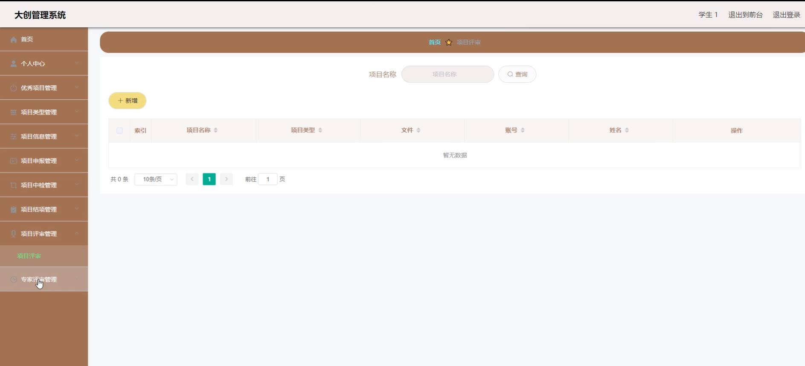

评审方案

指导老师端页面信息

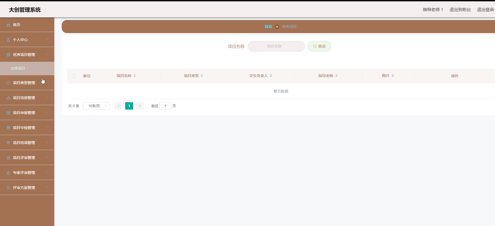

项目结算管理

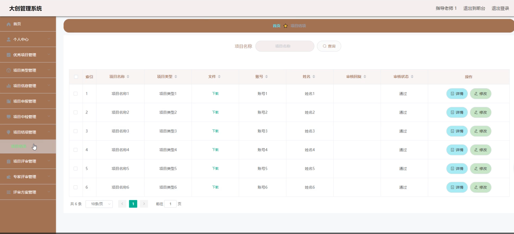

院系管理员端项目申报

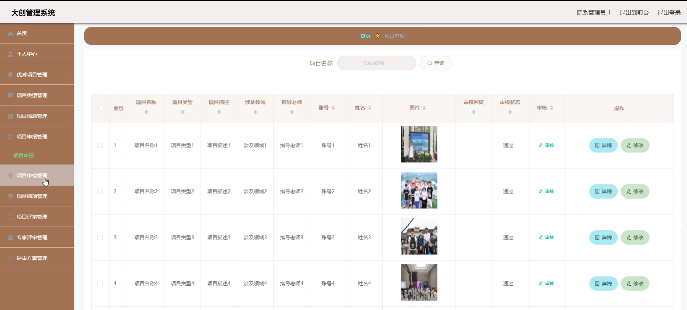

管理员端页面信息

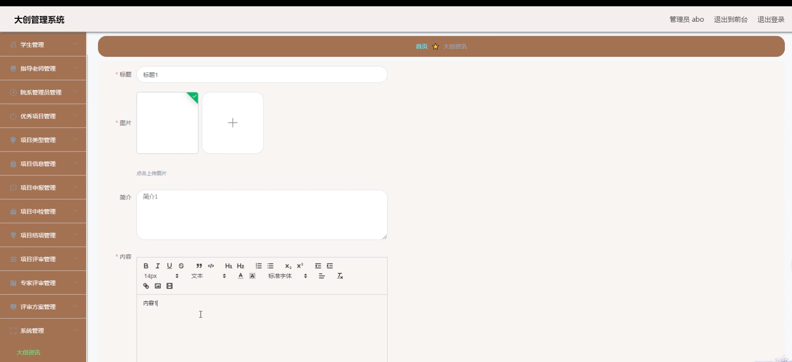

#### 总结

本基于 SpringBoot 的大创管理系统，通过精心设计的功能模块和合理的角色分工，实现了对大创项目全方位、多层次的有效管理。它不仅解决了传统管理模式的痛点，还为高校创新创业教育注入了新的活力，有力地推动了大创项目的高质量发展，为培养创新型人才提供了坚实的保障。

#### 使用说明

创建数据库，执行数据库脚本 修改jdbc数据库连接参数 下载安装maven依赖jar 启动idea中的springboot项目

后台地址：http://localhost:8080/springbootj2zt8/admin/dist/index.html

管理员  abo 密码 abo

前台地址：http://localhost:8080/springbootj2zt8/front/index.html

